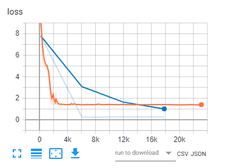

# Info
http://opennmt.net/OpenNMT-tf/quickstart.html
https://github.com/OpenNMT/Tokenizer/blob/master/docs/options.md

# Generating training data
`python ..\nlu_training_data_generator\generate_train_data.py 500000 0.7 0.15 0.15 0.0001 0.0001 0.00001 C:\Users\LeeBorlace\Documents\GitHub\logic-ml-bot\v1\nlu_training_data_generator\vocab.json C:\Users\LeeBorlace\Documents\GitHub\logic-ml-bot\v1\nlu_training_data_generator\training_templates.json 0.75`

`onmt-build-vocab --size 50000 --save_vocab english-vocab.txt english-train.txt`
`onmt-build-vocab --size 50000 --save_vocab logic-vocab.txt logic-train.txt`

# English to logic training
## Training (small)
`onmt-main train_and_eval --model_type NMTSmall --auto_config --config NMTSmall_eng_logic.yml`
`tensorboard --logdir="run-eng-logic"` - have to hit at localhost:6006

## Training (Transformer)
`onmt-main train_and_eval --model_type Transformer --auto_config --config Transformer_eng_logic.yml`
`tensorboard --logdir="run-eng-logic"` - have to hit at localhost:6006

# Logic to English training
## Training (small)
`onmt-main train_and_eval --model_type NMTSmall --auto_config --config NMTSmall_logic_eng.yml`
`tensorboard --logdir="run-logic-eng"` - have to hit at localhost:6006

## Training (Transformer)
`onmt-main train_and_eval --model_type Transformer --auto_config --config Transformer_logic_eng.yml`
`tensorboard --logdir="run-logic-eng"` - have to hit at localhost:6006

## Log
### Attempt 1
`python ..\nlu_training_data_generator\generate_train_data.py 500000 0.7 0.15 0.15 0.0001 0.0001 0.00001 C:\Users\LeeBorlace\Documents\GitHub\logic-ml-bot\v1\nlu_training_data_generator\vocab.json C:\Users\LeeBorlace\Documents\GitHub\logic-ml-bot\v1\nlu_training_data_generator\training_templates.json 0.75`

`onmt-build-vocab --size 29112 --save_vocab english-vocab.txt english-train.txt`

`onmt-build-vocab --size 26710 --save_vocab logic-vocab.txt logic-train.txt`

Ran for about 20 h

Loss bottomed out about 1.4

### Attempt 2 (TransformerBig)
`python ..\nlu_training_data_generator\generate_train_data.py 1000000 0.63 0.19 0.18 0.0001 0.0001 0.00001 C:\Users\LeeBorlace\Documents\GitHub\logic-ml-bot\v1\nlu_training_data_generator\vocab.json C:\Users\LeeBorlace\Documents\GitHub\logic-ml-bot\v1\nlu_training_data_generator\training_templates.json 0.75`

`onmt-build-vocab --size 29640 --save_vocab english-vocab.txt english-train.txt`
`onmt-build-vocab --size 27261 --save_vocab logic-vocab.txt logic-train.txt`
`onmt-main train_and_eval --model_type TransformerBig --auto_config --config Transformer_big_logic_eng.yml`
`tensorboard --logdir="run-logic-eng"`

Had to keep revising the batch size down until it would fit in the GPU!

# Inferring (using latest export)
`python infer.py run-logic-eng`

# Ideas to improve performance
- Use bigger vocab when generating samples - I think we're limiting it to too small a number given the number of examples
- More example templates!
- Use a smaller vocab when prepping the data for training - see what the ratio is for WMT sample for train / val / test batch sizes as well as the vocab for each
